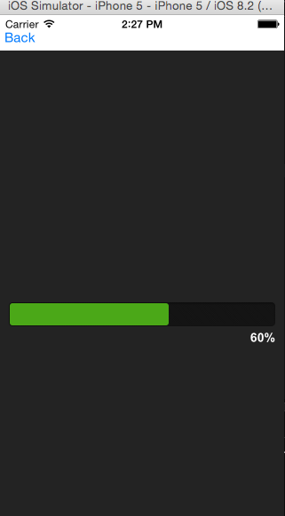
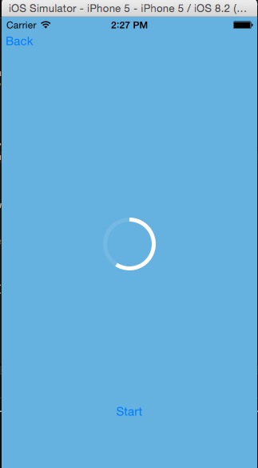

# VK_CustomProgressBarsTitanium
A custom progress bars for iOS Appcelerator Titanium using CommonJS pattern. It shows examples of creating and using progress bars both linear and circular. Both progress bars can be easily customised for any platform as written in Javascript. 

Linear and Circular Progress bars

